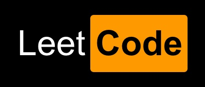

# Swift刷LeetCode

##  吐槽: Swift并不是刷题最佳语言，原因如下：

- Optional在工程上可以大大减少崩溃，但是在刷提的时候感觉真tm神烦；
- swift Class 默认不可hash，必须implement hashable protocol，所以Class不能做Dictionary的key；
- 缺少高级Collections，比如优先队列，需要自己实现。
- String Index 太恶心